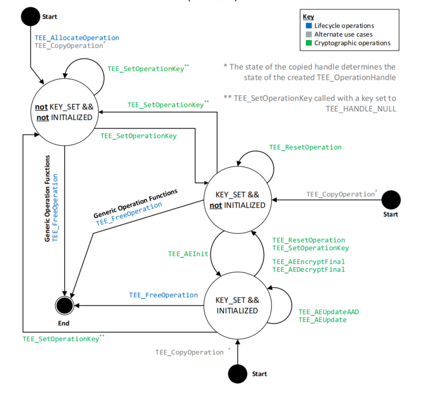

# AE(Authenticated Encryption) 认证加密案例

## 本案例使用`AES-GCM`与`AES-CCM` ##

GP规范认证加密状态图

### 步骤一 准备加密环境
 - 1. 申请一个全新的操作句柄`TEE_AllocateTransientObject`设置算法与模式(加密还是解密)
 - 2. 申请一个全新的临时对象句柄`TEE_AllocateTransientObject`
 - 3. 初始化一个引用值属性`TEE_InitRefAttribute`设置为密钥类型`TEE_ATTR_SECRET_VALUE`并设置密钥值(AES对称密钥需要自己提供)
 - 4. 设置操作句柄的对象句柄`TEE_SetOperationKey`

### 步骤二 初始化AE需要的参数
 - 1. IV(Initialization Vector)：初始化向量，AES-GCM规定长度为12字节，AES-CCM规定长度为7至13字节。
 - 2. tag_len(Tag)：认证标签长度，AES-GCM与AES-CCM都推荐16字节。
 - 3. aad_len(Additional Authenticated Data)：附加认证数据长度,可选参数。本案例不使用。
 - 4. 使用`TEE_AEInit`初始化AE参数。

### 步骤三 加密数据
 - 1. AES-GCM加密方式可以块式加解密，因此可以使用`TEE_AEUpdate`进行加密。
 - 2. AES-CCM加密方式只能单块加密，因此需要使用`TEE_AEEncryptFinal`进行加密。
 - 3. 使用`TEE_AEUpdate`只能加密数据，不能生成认证标签。
 - 4. 无论如何最后都需要使用`TEE_AEEncryptFinal`才可以生成认证标签。

### 步骤四 加密数据
 - 1. 重复前两个步骤，重新设置为解密模式
 - 2. AES-GCM解密方式可以块式加解密，因此可以使用`TEE_AEUpdate`进行解密。
 - 3. AES-CCM解密方式只能单块解密，因此需要使用`TEE_AEDecryptFinal`进行解密。
 - 4. 使用`TEE_AEUpdate`只能解密数据，不能验证认证标签。
 - 5. 无论如何最后都需要使用`TEE_AEDecryptFinal`才可以验证认证标签。

#### 注意
在解密传入认证标签时需要使用TEE_Malloc复制到TEE侧，再传入解密函数。因为认证标签需要在TEE侧的安全内存中才视为安全，否则会报Panic