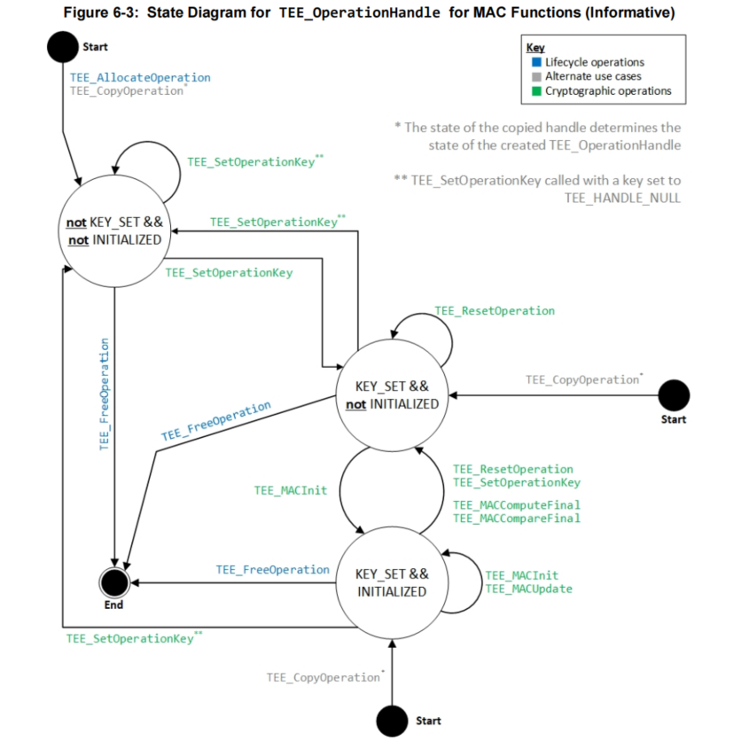

# HMAC(Hash-based Message Authentication Code) 案例

GP规范中的MAC状态图

## 步骤一: 初始化密钥
 - 1. `TEE_AllocateTransientObject`申请瞬态对象，用于存放密钥。
 - 2. `TEE_InitRefAttribute`初始化密钥属性，设置密钥类型为`TEE_TYPE_HMAC_MD5`等类型
 - 3. `TEE_PopulateTransientObject`将属性传给密钥对象
 - 4. `TEE_AllocateOperation` 申请操作句柄
 - 5. `TEE_SetOperationKey` 设置密钥到操作句柄中

## 步骤二: 计算消息认证码
 - 1. `TEE_MACInit` MAC初始化，设置IV(Initialization Vector)，本案例的算法不需要IV，所以可以不设置。
 - 2. `TEE_MACUpdate` MAC更新，如果消息块比较大，可以使用本接口分批输入到MAC算法中
 - 3. `TEE_MACComputeFinal` MAC计算，计算完成后，会得到消息认证码。如果消息块比较小，可以直接使用本接口，一次性计算。

## 步骤三: 验证消息认证码
 - 1. `TEE_MACInit` 再次初始化，重新计算消息认证码。
 - 2. `TEE_MACUpdate` 更新消息，与步骤二中的更新消息相同。
 - 3. `TEE_MACCompare` 比较消息认证码，如果相同，则验证成功。如果消息块比较小，可以直接使用本接口，一次性验证。