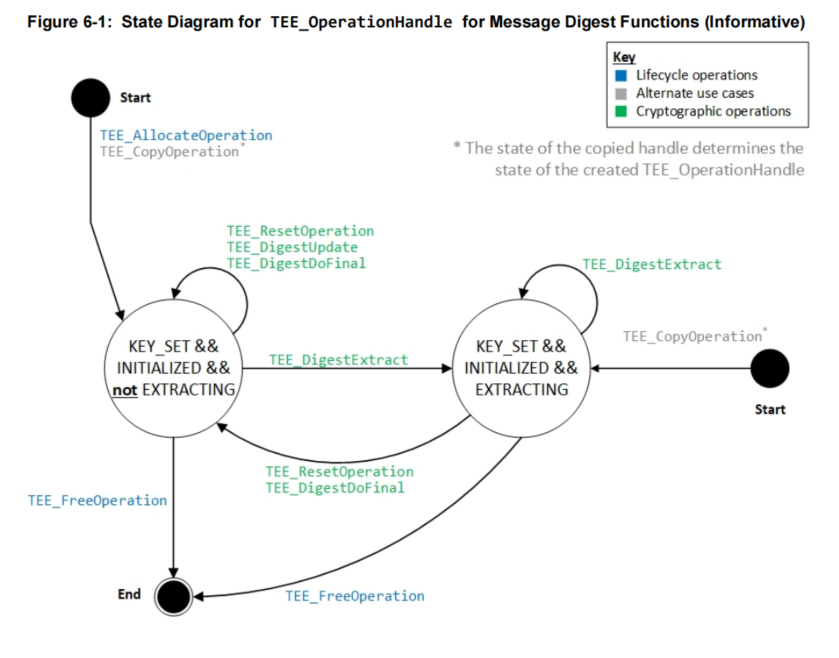

# Message Digest Example 信息摘要示例

GP规范信息摘要状态图

## 步骤一 初始化摘要算法类型
 - 1. `TEE_IsAlgorithmSupported` 判断算法是否支持
 - 2. `TEE_AllocateOperation` 申请操作句柄，提供算法类型，模式为`TEE_MODE_DIGEST`

## 步骤二 设置摘要参数
 - 1. 如果数据很多,可以使用`TEE_DigestUpdate`多次更新摘要数据
 - 2. 可以使用`TEE_DigestExtract`提取当前摘要值
 - 3. `TEE_DigestDoFinal` 传入剩下的数据完成摘要计算，获取摘要结果，如果数据少可以直接使用此接口一次性完成摘要计算